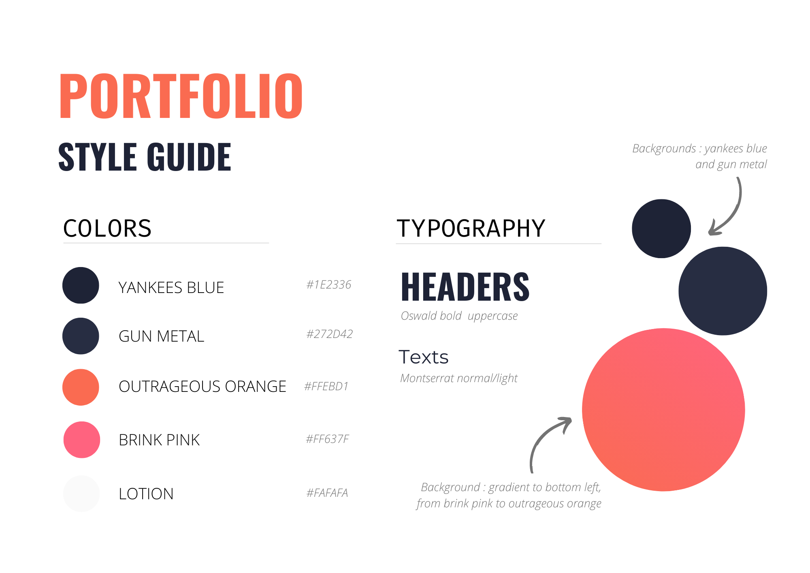
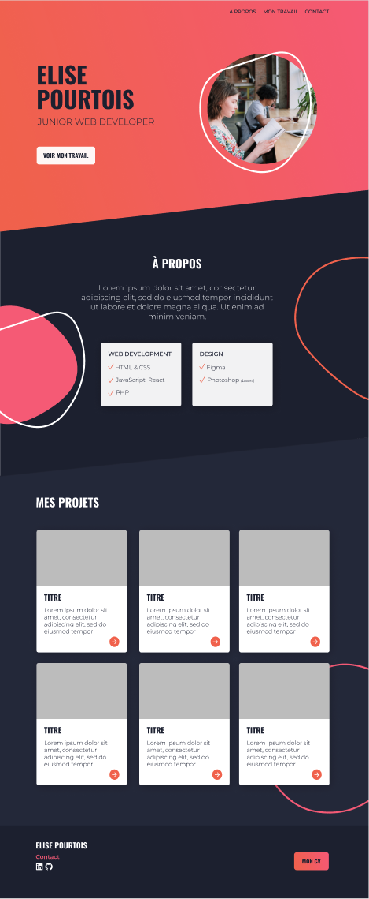

# Portfolio

_Work in progres... But you can already have a look [here](https://eliseprts.github.io/portfolio/)_

## Technologies used

## Mission

Creating my own portfolio

**Workflow**
- [x] Style Guide
- [x] Prototype
- [ ] Development [in progress]
- [x] Deployment [already deployed to share my work in progress] > [here](https://eliseprts.github.io/portfolio/)
- [ ] Share

**To do list**
- [x] Inclination of the sections
- [x] Animated hamburger menu
- [ ] Smooth scroll
- [ ] Add blobs in background of sections
- [ ] Add arrow to go back to the top of the page
- [x] Add modal "Work in progress"
- [ ] Replace the Lorem Ipsum with real text
- [ ] Add real projects in Work section

## Result

### Style guide

  

### Prototype

[Prototype created with Figma](https://www.figma.com/file/C2Xr0J2ekygGK9yaLaLiL7/Portfolio?node-id=38%3A2)

  

